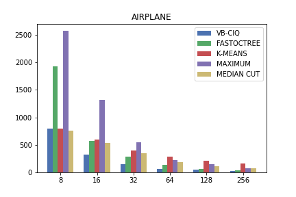
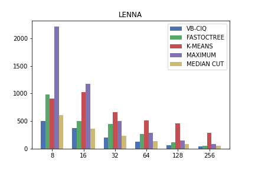
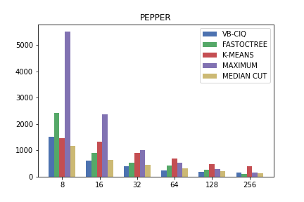
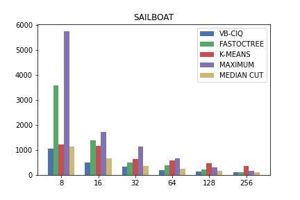
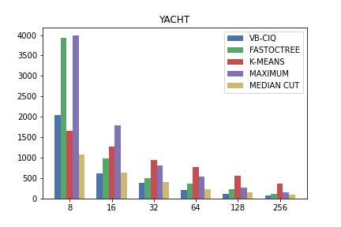
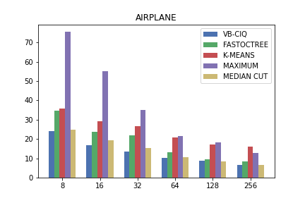
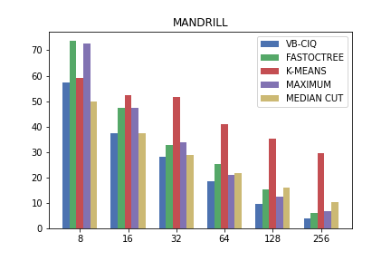
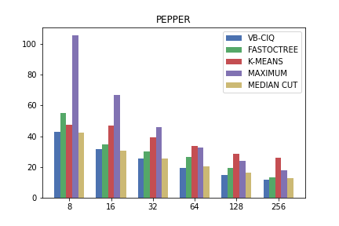
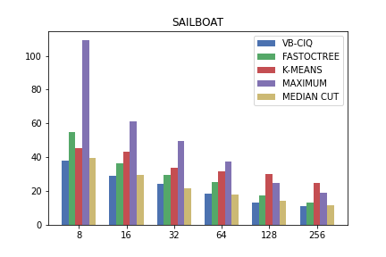
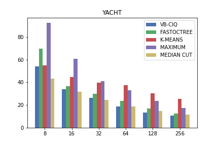

# Vector Based Color Image Quantization (VB-CIQ)

## Authors
- Navneet Melarkode
  - School of Computer Science Engineering, VIT, Vellore, India
  - Email: navneetmelarkode@gmail.com

- Varun Agarwal
  - School of Computer Science Engineering, VIT, Vellore, India
  - Email: varunswaika@gmail.com

## Abstract
This repository presents the implementation of Vector Based Color Image Quantization (VB-CIQ), a novel algorithm for generating color palettes from images. VB-CIQ utilizes graph algorithms for color selection, reducing runtime complexity, and optimizing computational power usage. The algorithm extends to 3D, addressing each component of the RGB values. Keywords: Color Image Quantization, Color Palette Generation, Vector Quantization, Image Processing.

## 1. Introduction
Color Image Quantization involves generating a color palette, crucial for various image processing applications. This research focuses on color palette generation, enabling users to specify the number of colors for any image. Each pixel in an image has three components: red, green, and blue. Ambiguities in color distance measurement persist, with debates on metrics like Euclidean distance and Hue distance.

## 2. Related Work and Methods
This section provides an overview of major algorithms used in color image quantization, including Octree, K-Means, and distance metrics such as Euclidean distance.

## 3. Proposed Method
VB-CIQ is presented as a two-phase algorithm. The first phase involves dimension reduction, creating a frequency map, and clustering colors within a threshold distance. The second phase focuses on color palette generation, using the reduced color set to create an undirected graph. Representative colors are iteratively selected based on the highest indegree, ensuring a diverse palette.

### 3.1 Graph Creation
Initialize a 2D adjacency matrix, set a threshold distance (`dmax`), and create edges between colors within the threshold distance.

### 3.2 Reduction Algorithm
Reduce dimensions by iterating over colors, clustering within a threshold distance, and creating a new color array.

### 3.3 VB-CIQ Algorithm
1. Generate a frequency map of all colors.
2. Initialize a palette of size `k`.
3. Use the reduction algorithm on colors.
4. Create a graph with reduced colors.
5. For each iteration (`i` from 0 to `k`):
   - Find the node with the maximum indegree.
   - Select the color as the representative (`palette[i]`).
   - Remove neighbors of the selected node.
   - Remove the selected node from the graph.
6. Return the generated palette.

## 4. Experimental Setup and Results
VB-CIQ has been tested against benchmark algorithms (Octree, K-Means, Maximum Coverage, Median Cut) on six standard color images. Key learning includes the algorithm's focus on depth for different `k` values.

### 4.1 Test Images

All the images have been taken from http://www.hlevkin.com/hlevkin/06testimages.htm and http://www.imageprocessingplace.com/root_files_V3/image_databases.htm . The reason for choosing images from these sources was to test algorithms regarding Color Image Quantization on images that were uncompressed. Each of these images have a file format of either .tiff/.tif/.bmp. For high quality images, a Tagged Image File Format (TIFF) /Bitmap (BMP) file format serves as an excellent representative.

### 4.2 Benchmark Algorithms
Benchmark algorithms, including Octree, K-Means, Maximum Coverage, and Median Cut, were used for comparison.

### 4.3 Performance Evaluation
VB-CIQ consistently outperformed other algorithms, as indicated by lower Mean Squared Error (MSE) and Mean Absolute Error (MAE) values. Visual comparisons showcased its superior performance in maintaining image details.

### 4.4 Key Learning
- VB-CIQ focuses on depth for lower `k` values, showcasing adaptability.
- Superior visual fidelity observed across various `k` values.

### 4.5 Results

MSE values for all test images using the benchmark algorithms and the proposed method

| IMAGE    | METHOD      | 8        | 16       | 32       | 64       | 128      | 256      |
|----------|-------------|----------|----------|----------|----------|----------|----------|
| LENNA    | VB-CIQ      | 503.57   | 369.28   | 207.75   | 130.69   | 67.29    | 42.31    |
|          | FASTOCTREE  | 987.65   | 507.32   | 450.46   | 265.21   | 122.62   | 55.95    |
|          | K-MEANS      | 911.16   | 1022.71  | 663.17   | 515.05   | 455.07   | 292.21   |
|          | MAXIMUM     | 2213.19  | 1173.66  | 507.05   | 292.8    | 150.82   | 80.74    |
|          | MEDIAN CUT  | 610.96   | 362.09   | 234.57   | 140.24   | 86.13    | 55.72    |
| AIRPLANE | VB-CIQ      | 798.2    | 326.32   | 154.43   | 66.13    | 48.53    | 29.76    |
|          | FASTOCTREE  | 1927.09  | 575.31   | 289.58   | 140.95   | 63.25    | 41.8     |
|          | K-MEANS      | 798.6    | 600.43   | 399.43   | 285.63   | 209.16   | 160.3    |
|          | MAXIMUM     | 2574.37  | 1316.23  | 548.39   | 218.78   | 154.85   | 78.22    |
|          | MEDIAN CUT  | 755.16   | 531.59   | 344.63   | 181.62   | 117.84   | 72.5     |
| MANDRILL | VB-CIQ      | 2144.22  | 865.1    | 465.02   | 228.15   | 87.91    | 11.14    |
|          | FASTOCTREE  | 4301.89  | 1794.17  | 576.35   | 414.42   | 214.95   | 30.59    |
|          | K-MEANS      | 1877.52  | 1514.89  | 1413.24  | 963.01   | 686.76   | 472.76   |
|          | MAXIMUM     | 2654.93  | 1128.41  | 588.52   | 249.65   | 90.5     | 24.49    |
|          | MEDIAN CUT  | 1341.51  | 769.34   | 480.04   | 285.08   | 166.67   | 75.67    |
| PEPPER   | VB-CIQ      | 1515.35  | 604.7    | 408.59   | 241.28   | 182.73   | 147.48   |
|          | FASTOCTREE  | 2414.58  | 918.65   | 526.52   | 421.4    | 261.57   | 117.32   |
|          | K-MEANS      | 1460.67  | 1337.52  | 914.32   | 704.59   | 477.39   | 392.46   |
|          | MAXIMUM     | 5518.01  | 2363.77  | 1021.7   | 533.61   | 282.8    | 159.28   |
|          | MEDIAN CUT  | 1181.08  | 640.87   | 459.76   | 326.85   | 225.61   | 144.02   |
| SAILBOAT | VB-CIQ      | 1058.43  | 509.99   | 338.09   | 201.43   | 135.67   | 111.1    |
|          | FASTOCTREE  | 3596.12  | 1383.01  | 487.09   | 396.79   | 217.35   | 116.95   |
|          | K-MEANS      | 1221.18  | 1177.95  | 643.19   | 577.15   | 486.3    | 356.2    |
|          | MAXIMUM     | 5763.44  | 1739.15  | 1134.58  | 654.31   | 294.97   | 174.13   |
|          | MEDIAN CUT  | 1141.98  | 660.84   | 359.15   | 243.69   | 165.43   | 113.92   |
| YACHT    | VB-CIQ      | 2052.36  | 620.67   | 394.34   | 207.86   | 119.77   | 80.51    |
|          | FASTOCTREE  | 3928.63  | 983.25   | 503.91   | 375      | 225.65   | 116.62   |
|          | K-MEANS      | 1664.1   | 1273.82  | 948.01   | 773.44   | 555.27   | 371.46   |
|          | MAXIMUM     | 3993.17  | 1789.83  | 816.95   | 530.81   | 272.5    | 146.5    |
|          | MEDIAN CUT  | 1071.8   | 641.85   | 411.96   | 239.71   | 156.03   | 102.07   |

MAE values for all test images using the benchmark algorithms and the proposed method

| IMAGE   | METHOD        | 8      | 16     | 32     | 64     | 128    | 256    |
|---------|---------------|--------|--------|--------|--------|--------|--------|
| LENNA   | VB-CIQ        | 29.06  | 25.18  | 19.05  | 15.49  | 10.81  | 8.48   |
|         | FASTOCTREE    | 36.76  | 30.53  | 28.63  | 19.77  | 13.31  | 10.29  |
|         | K-MEANS        | 41.28  | 42.81  | 35.05  | 29.98  | 28.79  | 23.01  |
|         | MAXIMUM        | 70.16  | 51.14  | 32.64  | 24.94  | 17.74  | 12.87  |
|         | MEDIAN CUT     | 32.34  | 24.69  | 19.13  | 14.65  | 11.36  | 9.04   |
| AIRPLANE| VB-CIQ        | 24.14  | 16.96  | 13.41  | 10.39  | 8.91   | 6.55   |
|         | FASTOCTREE    | 34.68  | 23.88  | 21.90  | 12.99  | 9.58   | 8.57   |
|         | K-MEANS        | 35.72  | 29.10  | 26.49  | 20.64  | 17.05  | 15.89  |
|         | MAXIMUM        | 75.61  | 55.18  | 35.19  | 21.39  | 18.26  | 12.73  |
|         | MEDIAN CUT     | 24.90  | 19.37  | 15.18  | 10.67  | 8.45   | 6.56   |
| MANDRILL| VB-CIQ        | 57.49  | 37.41  | 28.19  | 18.51  | 9.45   | 3.88   |
|         | FASTOCTREE    | 73.75  | 47.24  | 32.74  | 25.29  | 15.30  | 5.95   |
|         | K-MEANS        | 59.18  | 52.31  | 51.48  | 41.06  | 35.31  | 29.65  |
|         | MAXIMUM        | 72.64  | 47.24  | 33.65  | 20.89  | 12.38  | 6.86   |
|         | MEDIAN CUT     | 50.01  | 37.34  | 28.97  | 21.71  | 16.16  | 10.26  |
| PEPPER  | VB-CIQ        | 43.03  | 31.46  | 25.59  | 19.38  | 14.67  | 11.79  |
|         | FASTOCTREE    | 54.97  | 34.86  | 30.00  | 26.35  | 19.19  | 13.10  |
|         | K-MEANS        | 47.52  | 47.01  | 39.15  | 33.45  | 28.54  | 26.09  |
|         | MAXIMUM        | 105.71 | 66.88  | 46.14  | 32.68  | 23.90  | 17.89  |
|         | MEDIAN CUT     | 42.57  | 30.82  | 25.28  | 20.49  | 16.35  | 12.68  |
| SAILBOAT| VB-CIQ        | 37.98  | 29.04  | 24.19  | 18.46  | 13.43  | 11.27  |
|         | FASTOCTREE    | 54.76  | 36.36  | 29.40  | 25.23  | 17.23  | 13.05  |
|         | K-MEANS        | 45.52  | 43.51  | 33.83  | 31.61  | 30.06  | 25.04  |
|         | MAXIMUM        | 109.31 | 61.13  | 49.62  | 37.58  | 24.75  | 19.25  |
|         | MEDIAN CUT     | 39.71  | 29.46  | 21.87  | 17.72  | 14.38  | 11.72  |
| YACHT   | VB-CIQ        | 53.79  | 33.99  | 26.42  | 18.96  | 13.35  | 10.56  |
|         | FASTOCTREE    | 69.60  | 36.57  | 29.70  | 23.58  | 17.13  | 12.38  |
|         | K-MEANS        | 54.72  | 44.49  | 39.76  | 37.63  | 30.12  | 25.44  |
|         | MAXIMUM        | 92.41  | 60.64  | 40.95  | 33.00  | 23.85  | 17.33  |
|         | MEDIAN CUT     | 43.20  | 31.47  | 24.60  | 18.53  | 14.64  | 11.57  |

Here are some Graphs - 

MSE

MAE

## 5. Conclusion
VB-CIQ introduces a novel algorithm for color image quantization, showcasing superior performance in terms of quantization accuracy and visual fidelity. The algorithm's focus on depth and adaptability to different `k` values positions it as a benchmark for future studies in color image quantization.

For usage instructions and code implementation, please refer to the provided source code files. Feel free to contact the authors for any inquiries or collaborations.
